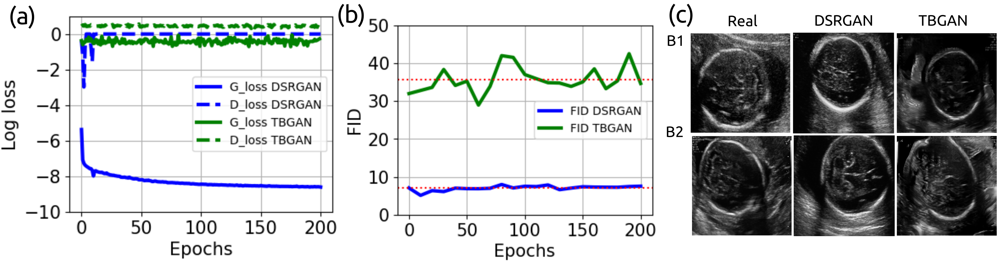

<h1 align="center">:page_facing_up: Towards Realistic Ultrasound Fetal Brain Imaging Synthesis (:baby: :brain: :robot:) </h1>
<div align="center">

Michelle Iskandar 2, Harvey Mannering 1, Zhanxiang Sun 1, Jacqueline Matthew 2, Hamideh Kerdegari 2, Laura Peralta 2, Miguel Xochicale 1    
1 University College London, and 2 King’s College London

</div>

[](https://arxiv.org/abs/2304.03941)

## Abstract
Prenatal ultrasound imaging is the first-choice modality to assess fetal health.
Medical image datasets for AI and ML methods must be diverse (i.e. diagnoses, diseases, pathologies, scanners, demographics, etc), however there are few public ultrasound fetal imaging datasets due to insufficient amounts of clinical data, patient privacy, rare occurrence of abnormalities in general practice, and limited experts for data collection and validation.
To address such data scarcity, we proposed generative adversarial networks (GAN)-based models, diffusion-super-resolution-GAN and transformer-based-GAN, to synthesise images of fetal ultrasound brain planes from one public dataset.
We reported that GAN-based methods can generate 256x256 pixel size of fetal ultrasound trans-cerebellum brain image plane with stable training losses, resulting in lower FID values for diffusion-super-resolution-GAN (average 7.04 and lower FID 5.09 at epoch 10) than the FID values of transformer-based-GAN (average 36.02 and lower 28.93 at epoch 60).
The results of this work illustrate the potential of GAN-based methods to synthesise realistic high-resolution ultrasound images, leading to future work with other fetal brain planes, anatomies, devices and the need of a pool of experts to evaluate synthesised images.


**Figure.** Results from Diffusion-Super-resolution-GAN (DSR-GAN) and transformer-based-GAN (TB-GAN):
	(a) Training losses for Generator and Discriminator networks,
	(b) FID scores, and
	(c) 256x256 pixel size trans-cerebellum images of two randomised batches (B1, B2) of real and synthesised (DSR-GAN and TB-GAN).


## Clone repository
After generating your SSH keys as suggested [here](https://docs.github.com/en/github/authenticating-to-github/generating-a-new-ssh-key-and-adding-it-to-the-ssh-agent) (or [here](https://github.com/mxochicale/tools/blob/main/github/SSH.md) with few extra notes).
You can then clone the repository by typing (or copying) the following lines in a terminal:
```
mkdir -p ~/repositories/budai4medtech && cd ~/repositories/budai4medtech # suggested path
git clone git@github.com:budai4medtech/midl2023.git
```

## Citations
BibTeX to cite
```
@misc{iskandar2023realistic,
      author={
      	Michelle Iskandar and 
      	Harvey Mannering and 
      	Zhanxiang Sun and 
      	Jacqueline Matthew and 
      	Hamideh Kerdegari and 
      	Laura Peralta and 
      	Miguel Xochicale},
      title={Towards Realistic Ultrasound Fetal Brain Imaging Synthesis}, 
      year={2023},
      eprint={2304.03941},
      archivePrefix={arXiv},
      primaryClass={eess.IV}
}
``` 

## Contributors
Thanks goes to all these people ([emoji key](https://allcontributors.org/docs/en/emoji-key)):  
<!-- ALL-CONTRIBUTORS-LIST:START - Do not remove or modify this section -->
<!-- prettier-ignore-start -->
<!-- markdownlint-disable -->
<table>
  <tr>
    <td align="center"><a href="https://github.com/michellepi"><br /><sub><b>Michelle Iskandar </b></sub>        </a><br /><a href="https://github.com/budai4medtech/midl2023/commits?author=michellepi" title="Code">💻 🤔 🔧 </a></td>
    <td align="center"><a href="https://github.com/harveymannering"><br /><sub><b>Harvey Mannering </b></sub>        </a><br /><a href="https://github.com/budai4medtech/midl2023/commits?author=harveymannering" title="Code">💻 🤔 🔧 </a></td>
    <td align="center"><a href="https://github.com/seansunn"><br /><sub><b>Zhanxiang (Sean) Sun </b></sub>        </a><br /><a href="https://github.com/budai4medtech/miua2022/commits?author=seansunn" title="Code">💻 🤔 🔧 </a></td>
    <td align="center"><a href="https://github.com/"><br /><sub><b>Jacqueline Matthew</b></sub>        </a><br /><a href="https://github.com/budai4medtech/midl2023/commits?author=" title="Research">  🔬 🤔  </a></td>    
    <td align="center"><a href="https://github.com/hamidehkerdegari"><br /><sub><b>Hamideh Kerdegari </b></sub>   </a><br /><a href="https://github.com/budai4medtech/midl2023/commits?author=hamidehkerdegari" title="Research">  🔬 🤔  </a></td>
    <td align="center"><a href="https://github.com/"><br /><sub><b>Laura Peralta</b></sub>        </a><br /><a href="https://github.com/budai4medtech/miua2022/commits?author=" title="Research">  🔬 🤔  </a></td>
    <td align="center"><a href="https://github.com/mxochicale"><br /><sub><b>Miguel Xochicale</b></sub>           </a><br /><a href="https://github.com/budai4medtech/midl2023/commits?author=mxochicale" title="Code and Research">💻 🔬 🤔 🔧 </a> <a href="https://github.com/budai4medtech/midl2023/commits?author=mxochicale" title="Documentation">📖 🔧 </a></td>
  </tr>
</table>
<!-- markdownlint-restore -->
<!-- prettier-ignore-end -->

<!-- ALL-CONTRIBUTORS-LIST:END -->

This work follows the [all-contributors](https://github.com/all-contributors/all-contributors) specification.  
Contributions of any kind welcome!


